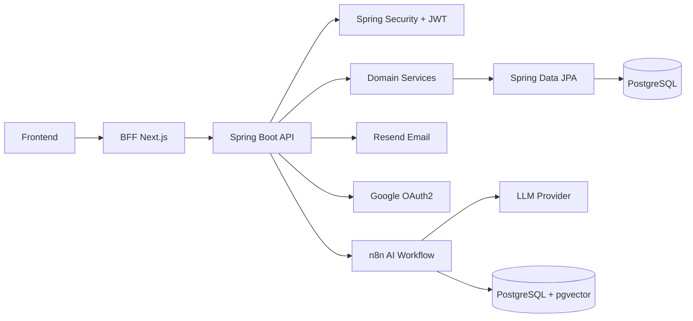

# AllanFlow Backend
API backend da plataforma AllanFlow, construída com Spring Boot para autenticação, gestão de workspaces, boards, tarefas e integrações externas da aplicação.

## Sobre o projeto
Este repositório contém a camada backend do sistema e concentra as regras de negócio, validações, autorização e persistência dos dados.

A API atende o frontend web da plataforma e expõe endpoints para autenticação, usuários, workspaces, boards, colunas, tarefas, labels, comentários, clientes, convites, dashboard e assistente de IA. Além disso, integra serviços externos como Google OAuth2, Resend para envio de e-mails e n8n para processamento do assistente de IA.

## Funcionalidades
- Gerenciamento de workspaces, boards, colunas e tarefas.
- Controle de membros e permissões por workspace e board.
- Sistema Kanban com movimentação e organização de tarefas.
- Gestão de labels, clientes, comentários e checklists.

## Arquitetura
O backend é organizado por domínios de negócio, com controllers, services, repositories, models, DTOs e mappers por módulo. O projeto segue uma organização modular baseada em domínio, mantendo responsabilidades separadas e facilitando evolução da aplicação.

Camadas principais:
- `controller`: expõe a API HTTP.
- `service`: concentra regras de negócio.
- `repository`: acesso a dados com Spring Data JPA.
- `model`: entidades persistidas.
- `dto`: contratos de entrada e saída.
- `mapper`: conversão entre entidades e DTOs.
- `config`: segurança, CORS, JWT, OpenAPI e propriedades.
- `shared`: exceções e respostas padronizadas.

Fluxo técnico:
- O frontend consome esta API via HTTP.
- Autenticação é baseada em JWT com cookie `access_token`.
- O Spring Security valida o token por header `Authorization` ou por cookie.
- A identificação do usuário autenticado é obtida por `@CurrentUserId`.
- A persistência usa PostgreSQL em produção e H2 em testes.
- Migrações do schema são gerenciadas com Flyway.

Diagrama simplificado:



## Tecnologias utilizadas
- Java 21
- Spring Boot 3.5.16
- Spring Web
- Spring Security
- OAuth2 Client e Resource Server
- Spring Data JPA
- Bean Validation
- Flyway
- PostgreSQL
- H2 para testes
- Swagger/OpenAPI com springdoc
- JWT com RSA
- Resend para envio de e-mails
- Bucket4j para rate limiting
- Lombok
- Maven Wrapper
- Docker
- n8n para automação e orquestração de fluxos de IA
- pgvector para armazenamento e busca vetorial

## Autenticação
O projeto usa autenticação baseada em JWT, com o token armazenado em cookie `HttpOnly`.

Como funciona:
- O login em `/auth/login` valida email e senha.
- Em caso de sucesso, a API gera um JWT assinado com chave RSA.
- O token é enviado ao navegador em um cookie chamado `access_token`.
- O backend aceita o JWT tanto via header `Authorization: Bearer ...` quanto via cookie.
- O endpoint `/auth/me` retorna os dados do usuário autenticado a partir do JWT.
- O login com Google também gera JWT e seta o mesmo cookie antes de redirecionar para o frontend.
- Rotas protegidas exigem a authority `ROLE_USER`.

Detalhes relevantes:
- O cookie pode usar `secure` e `domain` configuráveis por ambiente.
- O login, a recuperação de senha, a redefinição de senha, o cadastro e o chat de IA possuem rate limiting.
- O fluxo de convites aceita apenas o usuário correspondente ao email do convite.


## Deploy
Em produção, a aplicação é empacotada em um JAR Spring Boot e executada em container.

Pontos principais do deploy:
- `Dockerfile` usa build multi-stage com `eclipse-temurin:21-jdk-alpine` e runtime `21-jre-alpine`.
- O artefato final é executado com `java -jar app.jar`.
- O `docker-compose.prod.yml` sobe a API e o PostgreSQL.
- O proxy reverso é feito com Traefik, com HTTPS utilizando certificados gerenciados automaticamente.

Fluxo de produção:
- a imagem do backend é construída no container;
- o PostgreSQL sobe em uma rede interna;
- a API publica na porta `8080`;
- o Traefik encaminha requisições para o serviço backend.

## Estrutura do projeto
Estrutura resumida das principais pastas:

```text
.
├── src/main/java/com/allan/task/manager
│   ├── auth
│   ├── ai
│   ├── board
│   ├── checklist
│   ├── client
│   ├── column
│   ├── comment
│   ├── config
│   ├── dashboard
│   ├── email
│   ├── label
│   ├── membership
│   ├── passwordreset
│   ├── shared
│   ├── task
│   ├── user
│   ├── workspace
│   └── workspaceinvitation
├── src/main/resources/db/migration
├── src/main/resources/application*.yml
├── src/test/java
├── Dockerfile
└── docker-compose*.yml
```

## Segurança e boas práticas
- JWT assinado com RSA.
- Cookie de autenticação `HttpOnly`.
- CORS configurado por origem permitida.
- `ControllerAdvice` centralizado para erros e validações.
- Rate limiting em endpoints sensíveis.
- Separação clara entre controllers, services, repositories, DTOs e mappers.
- Validação de payloads com Jakarta Validation.
- `open-in-view` desabilitado.
- `ddl-auto: validate` em ambientes reais.
- Migrações versionadas com Flyway.
- Proteção de recursos por permissões de workspace e board.
- Logs e respostas de erro padronizados para facilitar integração com o frontend.
- Isolamento de dados baseado em workspace (multi-tenant).

## Autor
AllanGaBRs

[LinkedIn](https://linkedin.com/in/allan-gabriel-moreira-da-silva-9090a9271)
